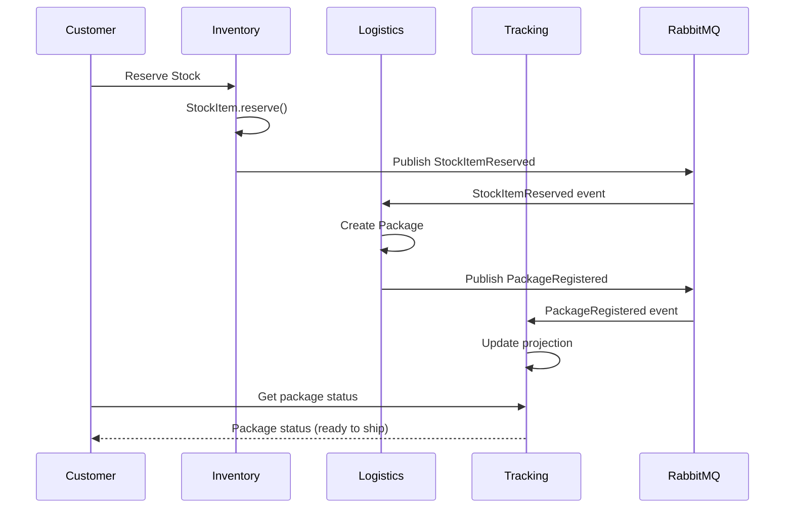

# 📦 Logistics DDD Platform

> **A production-grade inventory and logistics tracking system built with Domain-Driven Design, CQRS, and Event-Driven Architecture**

---

## 🎯 Purpose

This project demonstrates **enterprise-level software architecture** patterns used by companies like Amazon, FedEx, and Uber to manage complex logistics operations at scale.

### What You'll Learn

- ✅ **Domain-Driven Design (DDD)** - Model complex business logic with Aggregates, Value Objects, and Domain Events
- ✅ **CQRS** - Separate read and write operations for optimal performance
- ✅ **Event-Driven Architecture** - Decouple services with asynchronous messaging
- ✅ **Hexagonal Architecture** - Build testable, framework-independent code
- ✅ **Kubernetes Deployment** - Deploy microservices to production
- ✅ **Test-Driven Development** - Write tests first, then implementation

### Real-World Use Cases

This architecture is perfect for:

- 📦 **Logistics & Shipping** - Track packages across multiple warehouses and routes
- 🏭 **Inventory Management** - Manage stock across distributed locations
- 🛒 **E-commerce** - Handle orders, reservations, and fulfillment
- 🏦 **Financial Systems** - Process transactions with audit trails
- 🏥 **Healthcare** - Track patient records and medical supplies

---

## 🏗️ Architecture Overview

### Bounded Contexts

The system is divided into **3 independent bounded contexts**:

#### 1️⃣ **Inventory Context**

**Purpose**: Manage warehouse stock and reservations

**Aggregates**:

- `StockItem` - Represents physical inventory in a warehouse
- `Warehouse` - Physical location storing items

**Use Cases**:

- Add stock to warehouse
- Reserve stock for shipment
- Release reserved stock (if shipment cancelled)
- Check stock availability

**Events Published**:

- `StockItemAdded` - New inventory added
- `StockItemReserved` - Stock reserved for order
- `StockItemReleased` - Reservation cancelled
- `StockLevelLow` - Alert when stock below threshold

---

#### 2️⃣ **Logistics Context**

**Purpose**: Track packages through the delivery network

**Aggregates**:

- `Package` - Individual shipment being tracked
- `Route` - Planned path through distribution hubs
- `Shipment` - Group of packages traveling together

**Use Cases**:

- Register new package
- Assign package to route
- Update package location (scan at hub)
- Mark package as delivered
- Handle delivery exceptions (damaged, lost)

**Events Published**:

- `PackageRegistered` - Package entered system
- `PackageDispatched` - Package left warehouse
- `LocationUpdated` - Package scanned at new location
- `PackageDelivered` - Package reached destination
- `DeliveryFailed` - Delivery attempt unsuccessful

---

#### 3️⃣ **Backoffice Context (Read Side)**

**Purpose**: Provide fast queries for tracking and reporting

**Read Models (Projections)**:

- `TrackingView` - Real-time package status and location
- `InventoryView` - Current stock levels per warehouse
- `RouteProgressView` - Shipments in transit per route

**Use Cases**:

- Get package tracking status
- Get warehouse inventory levels
- Search packages by customer/date/status
- Generate analytics reports

**Events Consumed**:

- Listens to ALL events from Inventory and Logistics
- Rebuilds projections in ElasticSearch for fast queries

---

## 🔄 Event-Driven Flow Example

### Scenario: Customer Orders a Product



### Why This Matters

1. **Inventory** doesn't know about **Logistics** - they're decoupled
2. If Logistics is down, Inventory still works (eventual consistency)
3. **Tracking** is optimized for reads (ElasticSearch) while **Inventory** uses transactional DB
4. Can replay events to rebuild projections from scratch

---

## 🛠️ Technology Stack

### Language & Runtime

- **TypeScript 5.x** - Type-safe JavaScript with modern features
- **Node.js 20.x** - JavaScript runtime

### Web Framework

- **Express.js** - Minimal, fast HTTP server
- **REST API** - Standard HTTP endpoints

### Write-Side Database

- **PostgreSQL 15** - ACID-compliant relational database
- **TypeORM** - Type-safe ORM with decorators
- **Transactions** - Ensure data consistency

### Read-Side Database

- **ElasticSearch 8.x** - Fast full-text search and analytics
- **Purpose**: Store denormalized projections for queries
- **Why not just Postgres?** - ElasticSearch handles millions of search queries faster

### Message Broker

- **RabbitMQ 3.x** - Reliable message queue
- **AMQP Protocol** - Standard messaging protocol
- **Exchange Type**: Topic (allows flexible routing)
- **Features**: Durability, dead-letter queues, retries

### Testing

- **Jest** - Unit and integration testing
- **Cucumber** - Behavior-driven development (BDD)
- **Supertest** - HTTP endpoint testing
- **Docker Compose** - Integration test environment

### DevOps & Deployment

- **Docker** - Containerization
- **Docker Compose** - Local multi-container setup
- **Kubernetes (minikube)** - Container orchestration
- **Prometheus** - Metrics collection
- **Grafana** - Monitoring dashboards

### Code Quality

- **ESLint** - Code linting
- **Prettier** - Code formatting
- **Husky** - Git hooks for pre-commit checks

---

## 📂 Project Structure Philosophy

### Why This Structure?

```
src/
├── Contexts/           # Business domains (DDD Bounded Contexts)
│   ├── Inventory/      # Everything about warehouse stock
│   ├── Logistics/      # Everything about package delivery
│   └── Backoffice/     # Read-side projections
├── Shared/             # Reusable kernel (DDD base classes)
└── apps/               # Runnable applications (microservices)
```

### Key Principles

1. **Screaming Architecture** - Folder names reveal business purpose
2. **Context Independence** - Each context can be deployed separately
3. **Hexagonal Layers** - `domain/` has no framework dependencies
4. **Test Proximity** - Tests live next to code they test

### Inside Each Aggregate

```
StockItem/
├── application/        # Use cases (commands/queries)
│   ├── AddStock/       # One folder per use case
│   └── ReserveStock/
├── domain/             # Pure business logic (NO dependencies)
│   ├── StockItem.ts    # Aggregate root
│   ├── Quantity.ts     # Value object
│   └── events/         # Domain events
└── infrastructure/     # Framework-specific code
    ├── persistence/    # Database adapters
    └── controllers/    # HTTP endpoints
```

---

## ✅ Tasks & Milestones

### ✨ Phase 1: Foundation (Week 1)

**Goal**: Build the core DDD infrastructure

- [x] Project setup (TypeScript, Jest, ESLint)
- [x] Docker Compose (PostgreSQL, RabbitMQ)
- [ ] Shared Kernel
  - [ ] `AggregateRoot` base class
  - [ ] `DomainEvent` base class
  - [ ] `ValueObject` base class
  - [ ] `Uuid` value object
- [ ] First Aggregate: `StockItem`
  - [ ] Domain model
  - [ ] Value objects (`StockItemId`, `Quantity`)
  - [ ] `StockItemAdded` event
  - [ ] Unit tests
- [ ] First Use Case: `AddStock`
  - [ ] Command
  - [ ] Command handler
  - [ ] Repository interface
- [ ] PostgreSQL Persistence
  - [ ] TypeORM entity
  - [ ] Repository implementation
  - [ ] Integration tests
- [ ] First HTTP Endpoint
  - [ ] `POST /stock-items`
  - [ ] Controller
  - [ ] Acceptance test

**Deliverable**: Can add stock items via HTTP, persisted to PostgreSQL

---

### 🔄 Phase 2: Event-Driven Architecture (Week 2)

**Goal**: Decouple contexts with events

- [ ] RabbitMQ Infrastructure
  - [ ] `RabbitMQConnection` wrapper
  - [ ] `RabbitMQEventBus` implementation
  - [ ] Exchange and queue setup
- [ ] Event Publishing
  - [ ] Publish `StockItemAdded` after save
  - [ ] Event serialization
  - [ ] Integration test
- [ ] First Event Consumer
  - [ ] `RabbitMQConsumer` base class
  - [ ] Listen to `StockItemAdded`
  - [ ] Log events (simple handler)
- [ ] Second Use Case: `ReserveStock`
  - [ ] Command
  - [ ] Command handler
  - [ ] `StockItemReserved` event
  - [ ] Business rule: Can't reserve more than available
- [ ] Cross-Context Communication
  - [ ] Logistics listens to `StockItemReserved`
  - [ ] Auto-create `Package` when stock reserved

**Deliverable**: Reserving stock triggers package creation automatically

---

### 📊 Phase 3: CQRS & Projections (Week 3)

**Goal**: Separate reads from writes

- [ ] ElasticSearch Setup
  - [ ] Docker Compose service
  - [ ] Client configuration
  - [ ] Index creation
- [ ] Tracking Projection
  - [ ] `TrackingView` read model
  - [ ] Projection builder
  - [ ] Event consumer updates projection
- [ ] Query API
  - [ ] `GET /packages/:id/tracking`
  - [ ] `GET /warehouses/:id/inventory`
  - [ ] Query handler
- [ ] Projection Rebuilding
  - [ ] Command to replay all events
  - [ ] Rebuild projection from event store
- [ ] Performance Testing
  - [ ] Load test write endpoints
  - [ ] Load test read endpoints
  - [ ] Compare projection vs direct query

**Deliverable**: Fast read queries from ElasticSearch, separate from write DB

---

### 📦 Phase 4: Second Bounded Context (Week 4)

**Goal**: Complete logistics domain

- [ ] Package Aggregate
  - [ ] Domain model
  - [ ] Value objects (`PackageId`, `TrackingNumber`)
  - [ ] `PackageRegistered` event
  - [ ] `LocationUpdated` event
  - [ ] `PackageDelivered` event
- [ ] Package Use Cases
  - [ ] `RegisterPackage`
  - [ ] `UpdateLocation`
  - [ ] `MarkDelivered`
- [ ] Route Aggregate
  - [ ] Domain model
  - [ ] Route optimization logic
  - [ ] `RouteAssigned` event
- [ ] Logistics API
  - [ ] `POST /packages`
  - [ ] `PUT /packages/:id/location`
  - [ ] `POST /packages/:id/deliver`
- [ ] End-to-End Flow
  - [ ] Reserve stock → Create package → Update location → Deliver
  - [ ] Acceptance test for full flow

**Deliverable**: Complete logistics tracking from warehouse to delivery

---

### ☸️ Phase 5: Kubernetes Deployment (Bonus)

**Goal**: Production-ready deployment

- [ ] Dockerfiles
  - [ ] Multi-stage build
  - [ ] Optimized image size
- [ ] Kubernetes Manifests
  - [ ] Deployments (Inventory, Logistics, Backoffice)
  - [ ] Services
  - [ ] ConfigMaps
  - [ ] Secrets
- [ ] StatefulSets
  - [ ] PostgreSQL
  - [ ] RabbitMQ
  - [ ] ElasticSearch
- [ ] Ingress
  - [ ] Route traffic to services
  - [ ] TLS termination
- [ ] Health Checks
  - [ ] Liveness probes
  - [ ] Readiness probes
- [ ] Monitoring
  - [ ] Prometheus metrics
  - [ ] Grafana dashboards
  - [ ] Alert rules

**Deliverable**: Deploy to local Kubernetes cluster with `kubectl apply`

---

## 🎓 Learning Resources

### Domain-Driven Design

- 📘 **Book**: "Domain-Driven Design" by Eric Evans
- 📘 **Book**: "Implementing Domain-Driven Design" by Vaughn Vernon
- 🎥 **Course**: CodelyTV Pro (Spanish, excellent quality)
- 🌐 **Blog**: Martin Fowler's DDD articles

### CQRS & Event Sourcing

- 📘 **Book**: "Versioning in an Event Sourced System" by Greg Young
- 🎥 **Talk**: "CQRS and Event Sourcing" by Greg Young
- 🌐 **Resource**: Microsoft's CQRS Journey

### Event-Driven Architecture

- 📘 **Book**: "Building Event-Driven Microservices" by Adam Bellemare
- 📘 **Book**: "Enterprise Integration Patterns" by Gregor Hohpe
- 🎥 **Talk**: "The Many Meanings of Event-Driven Architecture" by Martin Fowler

### Kubernetes

- 📘 **Book**: "Kubernetes in Action" by Marko Lukša
- 🎥 **Course**: "Kubernetes for Developers" (Udemy)
- 🌐 **Docs**: Official Kubernetes documentation

---

## 🚀 Getting Started

### Prerequisites

- Node.js 20+
- Docker & Docker Compose
- Git
- (Optional) Minikube for Kubernetes

### Quick Start

```bash
# 1. Clone repository
git clone https://github.com/yourusername/logistics-ddd-platform.git
cd logistics-ddd-platform

# 2. Install dependencies
npm install

# 3. Start infrastructure
docker-compose up -d

# 4. Run migrations
npm run migrate

# 5. Start development server
npm run dev

# 6. Run tests
npm test
```

### First API Call

```bash
# Add stock to warehouse
curl -X POST http://localhost:3000/stock-items \
  -H "Content-Type: application/json" \
  -d '{
    "id": "550e8400-e29b-41d4-a716-446655440000",
    "name": "iPhone 15 Pro",
    "quantity": 100,
    "warehouseId": "warehouse-1"
  }'

# Reserve stock
curl -X POST http://localhost:3000/stock-items/550e8400-e29b-41d4-a716-446655440000/reserve \
  -H "Content-Type: application/json" \
  -d '{
    "quantity": 2
  }'

# Check tracking (after projection built)
curl http://localhost:3000/packages/tracking
```

---

## 🤝 Contributing

This is a learning project! Contributions welcome:

1. **Report bugs** - Open an issue
2. **Suggest features** - Explain the business use case
3. **Submit PRs** - Follow DDD principles
4. **Improve docs** - Help others learn

### Code Standards

- ✅ Write tests first (TDD)
- ✅ Use meaningful domain language (ubiquitous language)
- ✅ Keep aggregates small and focused
- ✅ Domain layer has ZERO framework dependencies
- ✅ Events are immutable and past-tense

---

## 📜 License

MIT License - Use this for learning and portfolio projects!

---

## 🙏 Acknowledgments

Inspired by:

- **CodelyTV** - Excellent DDD/Hexagonal Architecture examples
- **Vaughn Vernon** - DDD thought leader
- **Martin Fowler** - Software architecture wisdom
- **Greg Young** - CQRS/Event Sourcing pioneer

---

## 📞 Questions?

This is a complex architecture! Don't hesitate to:

- Open GitHub issues
- Read the `/docs` folder for deep dives
- Check the tests - they're executable documentation

**Remember**: The goal is LEARNING, not perfection. Build incrementally, understand each pattern, then move forward.

Happy coding! 🚀


docker-compose run --rm test  
create the db 

docker-compose -f infra/docker-compose.yml up --build


## 🤔 RFID Integration Possibility

**Yes, absolutely!** RFID functionality would be a perfect extension for your logistics platform. Here's how it could fit:

## 🎯 **RFID Use Cases in Your System:**

### **📦 Asset Tracking**
- **RFID Tags** on stock items for unique identification
- **Automated Inventory** - Scan items in/out automatically
- **Location Tracking** - Know where items are in real-time

### **🚚 Supply Chain Integration**
- **Warehouse Management** - Track items through fulfillment pipeline
- **Shipping Verification** - Ensure correct items are shipped
- **Receiving Automation** - Automatically update inventory on arrival

### **🏭 Manufacturing Integration**
- **Production Tracking** - Monitor items through assembly
- **Quality Control** - Verify components and final products
- **Batch Tracking** - Trace product origins and components

## 🏗️ **Architecture Integration:**

### **Current System + RFID:**
```
┌─────────────────┐    ┌──────────────────┐    ┌─────────────────┐
│   Write API     │───▶│  Domain Events   │───▶│  RFID Readers   │
│  (Inventory)    │    │  (RabbitMQ)      │    │  (IoT Devices)  │
└─────────────────┘    └──────────────────┘    └─────────────────┘
         │                        │                        │
         ▼                        ▼                        ▼
┌─────────────────┐    ┌──────────────────┐    ┌─────────────────┐
│  Event Store    │    │  RFID Events     │    │  RFID Service   │
│  (PostgreSQL)   │    │  (ElasticSearch) │    │  (Processing)    │
└─────────────────┘    └──────────────────┘    └─────────────────┘
         │                        │                        │
         ▼                        ▼                        ▼
┌─────────────────┐    ┌──────────────────┐    ┌─────────────────┐
│   Read API      │◀───│  Projections     │◀───│  RFID Tags      │
│  (Backoffice)   │    │  (ElasticSearch) │    │  (Database)     │
└─────────────────┘    └──────────────────┘    └─────────────────┘
```

## 🚀 **Implementation Approach:**

### **Phase 1: RFID Event Processing** ⏱️ **2-3 hours**
```typescript
// New RFID domain events
export class RFIDTagRead extends DomainEvent<RFIDTagReadPayload> {
  constructor(
    params: { aggregateId: RFIDTagId },
    private readonly tagId: RFIDTagId,
    private readonly location: Location,
    private readonly timestamp: Date
  ) {
    super(params);
  }
}

// RFID event projector
export class RFIDTagReadProjector implements DomainEventSubscriber<RFIDTagRead> {
  // Update item location in projections
}
```

### **Phase 2: RFID Reader Integration** ⏱️ **3-4 hours**
```typescript
// RFID Reader service
export class RFIDReaderService {
  async readTag(tagId: string): Promise<RFIDTagData> {
    // Hardware integration
  }
}

// REST API for RFID operations
router.post('/rfid/read', (req, res) => rfidController.processRead(req, res));
```

### **Phase 3: Real-time Dashboard** ⏱️ **2-3 hours**
```typescript
// WebSocket for real-time updates
// Dashboard showing item locations
// Alert system for missing items
```

## 🛠️ **Technical Considerations:**

### **Hardware Integration:**
- **RFID Readers** - USB/Serial devices or network-based readers
- **Tag Types** - Passive/active RFID tags
- **Protocols** - EPC Gen2, NFC, etc.

### **Software Components:**
- **Device Drivers** - Node.js serial port libraries
- **Event Processing** - Real-time RFID read processing
- **Data Storage** - RFID tag metadata in database
- **Real-time UI** - WebSocket updates for live tracking

## 💡 **Business Value:**

### **Operational Efficiency:**
- **Automated Inventory** - No manual counting needed
- **Error Reduction** - Eliminate manual data entry mistakes
- **Real-time Visibility** - Know exactly where items are

### **Advanced Features:**
- **Geofencing** - Alert when items leave designated areas
- **Anti-theft** - Track unauthorized item movement
- **Analytics** - Item movement patterns and optimization

## 🎯 **Recommended Implementation:**

1. **Start Simple** - Basic RFID tag reading and inventory updates
2. **Add Real-time** - WebSocket dashboard for live tracking  
3. **Advanced Features** - Geofencing, analytics, mobile app integration

**Total estimated time: 8-12 hours** for a complete RFID integration that adds significant business value to your logistics platform!

Would you like me to start implementing the RFID functionality, or would you prefer to complete the current Phase 3 (CQRS) first?

[8 tools called]

Based on the current implementation, **Phase 4** would be the **"Package/Logistics Bounded Context"** that includes:

## 📦 **Phase 4: Second Bounded Context (Package/Logistics)**

### **Current Status:**
- ✅ **Phase 1**: Basic DDD Setup
- ✅ **Phase 2**: Event-Driven Architecture  
- 🔄 **Phase 3**: CQRS Implementation (in progress)
- ⏳ **Phase 4**: Package/Logistics Context (next)

### **Phase 4 Scope:**
- 📦 **Package Aggregate** - Domain model for shipments/packages
- 🔗 **Cross-Context Events** - Integration between Inventory and Package contexts
- 📊 **Package Projections** - Read models for package tracking
- 🚚 **Auto Package Creation** - Automatic package creation from stock reservations
- 🔄 **Multi-Context Projections** - Combined views across contexts

## 🤔 **RFID Implementation Timing:**

**Yes, you could implement RFID before Phase 4!** Here's why:

### **Option 1: RFID as Phase 3.5** ⏱️ **Before Phase 4**
```bash
Phase 3: CQRS ✅ 
  ↓
Phase 3.5: RFID Integration (8-12 hours)
  ↓  
Phase 4: Package/Logistics Context
```

### **Option 2: RFID within Phase 4** ⏱️ **As part of Phase 4**
```bash
Phase 3: CQRS ✅
  ↓
Phase 4: Package Context + RFID (12-16 hours)
```

## 🎯 **Recommended Approach: RFID as Phase 3.5**

**Why before Phase 4?**

1. **🔧 Technical Fit**: RFID works with current Inventory context
2. **📈 Business Value**: Immediate asset tracking capability
3. **🏗️ Architecture**: Complements existing event-driven system
4. **🧪 Testing**: Easier to test RFID with current inventory system

## 🚀 **RFID Implementation Plan:**

### **Phase 3.5: RFID Integration** ⏱️ **8-12 hours**

#### **1. RFID Domain Foundation** ⏱️ **2-3 hours**
```typescript
// RFID Tag aggregate
export class RFIDTag extends AggregateRoot {
  constructor(
    private readonly _tagId: RFIDTagId,
    private readonly _itemId: StockItemId,
    private readonly _location: Location
  ) { super(); }
}
```

#### **2. RFID Hardware Integration** ⏱️ **3-4 hours**
```typescript
// RFID Reader service
export class RFIDReaderService {
  async readTag(): Promise<RFIDTagData> {
    // Serial port / Network integration
  }
}
```

#### **3. Event Processing & Projections** ⏱️ **2-3 hours**
```typescript
// RFID read events → Update item locations
// Real-time location projections
```

#### **4. Real-time Dashboard** ⏱️ **2-3 hours**
```typescript
// WebSocket for live tracking
// Location-based alerts
```

## 💡 **Strategic Benefits:**

- **🛠️ Technical**: Leverages existing event-driven architecture
- **💼 Business**: Immediate ROI for asset tracking
- **🏗️ Architecture**: Enhances current system without major refactoring
- **📊 Analytics**: Foundation for logistics optimization

**Would you like me to start implementing RFID functionality as Phase 3.5, or would you prefer to complete Phase 4 (Package context) first?** 

RFID would be a valuable addition that enhances your current inventory system with real-world asset tracking capabilities!